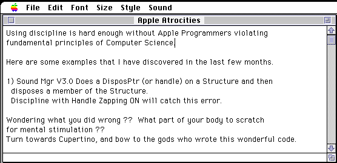
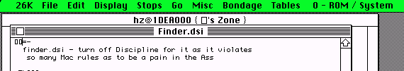
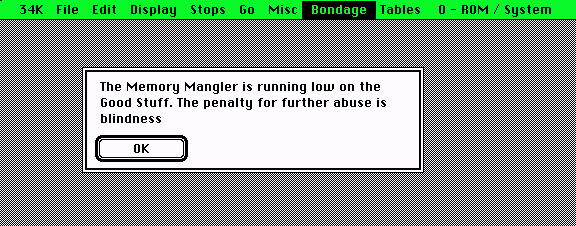
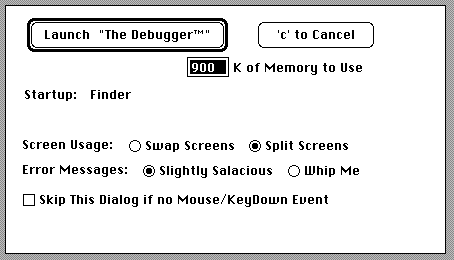

+++
title = "Some amusing things on MacNosy"
date = "2024-04-16"

[taxonomies]
tags = ["macnosy", "retro-tech"]
+++

# some amusing things on MacNosy

I know this is software that many might've used, or that it's still being used for homebrew/modding/maintaining(?????) Classic MacOS software.

But what surprised me the most was the verbosity and tone of most of the UI and documentation. Gonna show some of the most intriguing I found in a night of screwing around.

