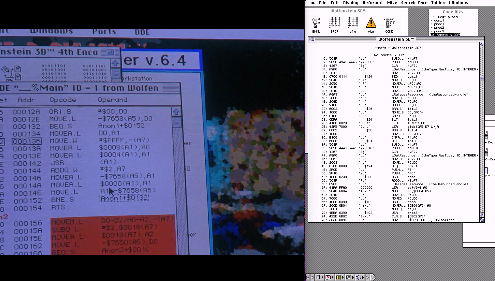
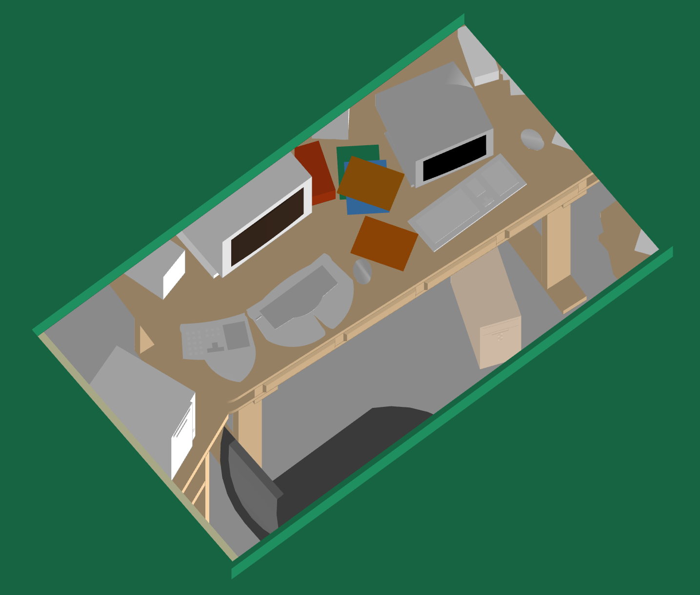

+++
title = "Are the computer scenes in The Net (1995) real?"
date = "2024-07-16"

[taxonomies]
tags = ["retro-tech"]
+++

# i went into a 5 HOUR HYPERFOCUS SIDEQUEST because i HAD TO KNOW if this scene was accurate

This is a much more light-hearted blog post. Skip if you're for more serious stuff.

---

So, I wondered after the last time I watched this scene couple days ago _(yes, still The Net from 1995)_: how real is it?

**The question:** Is it valid 68k/PPC ASM? Is it from the game itself?

## The setup

Basilisk II, Quadra 900, 68030+FPU, 128MB (!) RAM, System 7.5.3
Because Basilisk is _finnicky, to put it very, very very mildly_, I couldn't trigger MacsBug _directly_, so I used **MacNosy II** to debug. Alongside this, I got ResEdit to complete the software kit to tear Classic Mac OS software down.

## The process

- Get Wolf3D for Mac OS.
- Do the satanic incantations to get MacNosy to run. I don't know anything about what I did, or how I should do anything, but I opened the Data Table. I mean, there's some ASM there.

## The results

- If you crop the window to the first 3 icons on ResEdit, it matches the icons!
- The instructions, at least the ASCII, _indeed is valid **68k** ASM!_.
- Is it from the game? I don't know, couldn't make it run any further. Maybe if I had more braincell reception I could go further but it's 01:30am.

## Some extra observations

- It looks like it's running on a Power Macintosh 8xxx. On the _final retail version_ of Wolf3D you have fat binaries. If I ran it on SheepShaver as a PowerMac, it would've defaulted to the PPC version _for obvious reasons._ This is why I used Basilisk II and a Quadra ROM instead.
- If you get an _A/ROSE unimplemented trap_, it's because it installed an extension for the [Apple Real Time Operative System Extension](https://en.wikipedia.org/wiki/A/ROSE). It came with the networking drivers. Delete it before rebooting, or don't install networking support.
- About A/ROSE, it's a _fucking Real Time OS, with **pre-emptive multitasking when the host OS didn't even have it**._ And even funnier, it's meant to run on 68k's inside NuBus cards to "make it easier to develop NuBus expansion cards for the Mac." I find it _so overengineered_ to have such a level of _computer exuberance and debauchery_ for your stupid Ethernet card. Truly a fascinating sidequest to someday come back to.
- I'm surprised about the accuracy of this film to System 7's UI. They **had** to have someone coding or recreating every scene, or they indeed had some real systems analyst doing the scenes. You can see _real_ Chooser menus, _real_ MacsBug, _real_ Windows 3.1 terminals. Now, of course you have _some mocked up things on top_... but they look convincing enough for someone _that knows and notices those details._
- Yes the monitor there is, indeed, a Radius monitor. Gotta have the best gear for _hacking!_
- I could go on but the boyfriend would complain that I stayed up too late. Oh well...