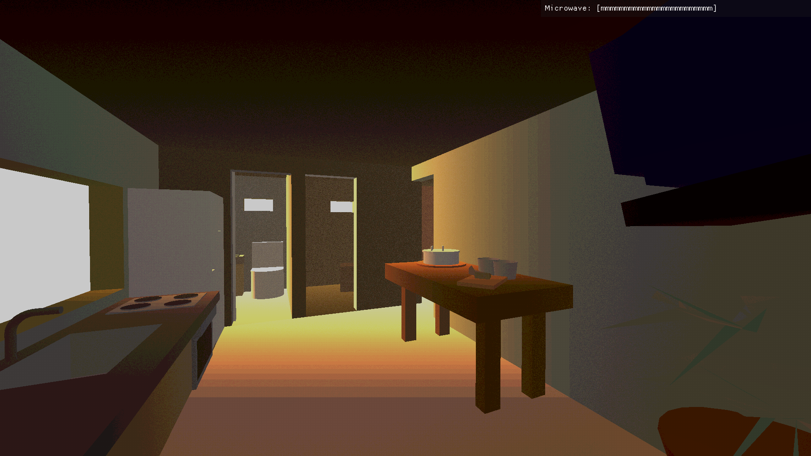
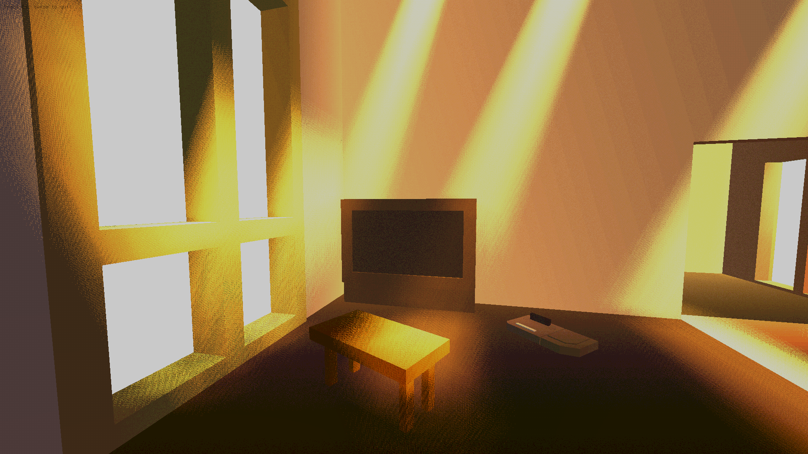
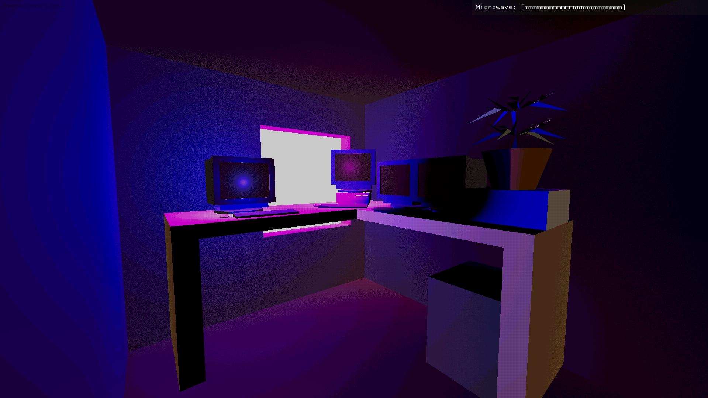
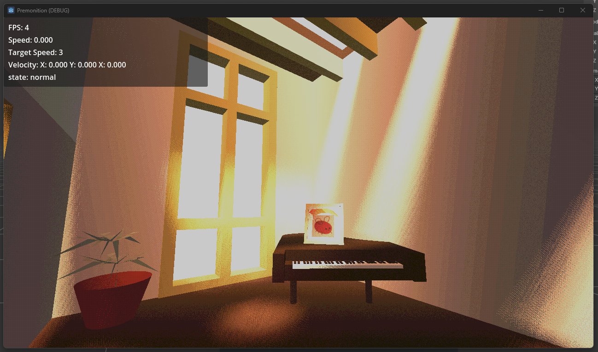
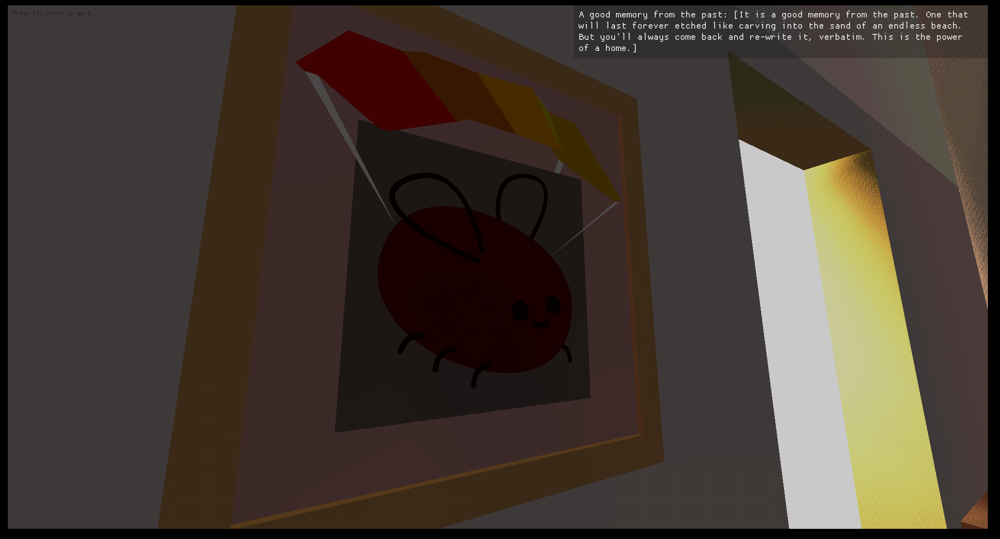
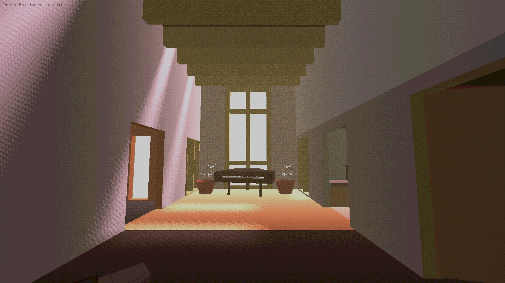

+++
title = "Premonition - my first game jam."
date = "2025-09-16"

[taxonomies]
tags = ["gamedev", "premonition"]

[extra]
cover = "premonition-5.png"
+++

These are the thoughts I made when I did my first game jam: Brackeys 12. It's not a professional write-up, so don't expect anything more than just the raw experience of doing my first game.

# I did a game in less than a day

And you can play it, right now.
*not endorsed by cohost at all. it just happens to be pretty on topic.
<p style="color: white; font-size: 64px; font-weight: bold; text-align: center">
<a href="https://itch.io/jam/brackeys-12/rate/2973693">Premonition</a>

</p>
<p style="color: white; font-size: 14px; font-weight: bold; text-align: center">
You don't know calm until you're knee deep inside the storm.
</p>

Please go rate it on the link above, and please _be absolutely legit honest_ with it. I cannot be better if you sugar-coat feedback. Now, if you want to know the whole story, carry on:

## Summary



You're in your house, surrounded by the calm of your memories, stored inside each of the things you own. Before you know it, they start disappearing until you are alone. And all you have left are the fleeting memories, and the realisation that these might go away.

Losing your mind is the most terrifying storm you can go through.

## Gameplay loop



- You are inside a house. It's full of things.
  - Get near them and some text will appear in the top-right corner. 
- Each game session is completely random. You will lose your memory quicker, or slower.
- Each interaction throws a dice to check if you will lose an object or not.¹
- You will never see everything in one playthrough.²
- There's at least 25 objects, with 5 lines of text each.³
- Each line concatenate with each other. They're shown at random, so you might get the same one several times, or all different in one go.
  - You'll have to play several times to see them all and piece out the story.⁴

### Aim
- Figure out who are you controlling.
  - If you're terminally online like me, you'll see a lot of small detail that you'll love. Send me a message if you find one out!
- Experiment with a _specific_ technique I have been trying to perfect for the last 3 months.
- See if I'm up to the challenge.
- _git gud at code._
  - specially good at git. _More on that later_
- Learn Godot on a project from cradle to grave. Well, maybe not _grave_.

## Lessons learned

1. Modularity with focus.
2. Your instrument doesn't matter if you know how to play it.
3. Bad games are better than _unreleased_ games.

### The Subway approach



<p style="color: white; font-size: 14px; font-weight: bold; text-align: center">
Spend your time building ingredients to cook different meals, but keep your focus on making sandwiches.
</p>

Or, _think modular but have a set goal in mind._ 

This is where my experience of _almost_ a decade in the architectural battleground were _essential_ to survival. We had these kinds of short development cycles with gruelling deadlines _weekly._ I was used to this. I quit because I had to do this _whilst having a severe technical disadvantage on the construction side._ This is why I hated it.

Not here. Computers are my natural habitat. And here's the single biggest knowledge transfer I can give to this field: **build software like you'd make you a sandwich.**

But Frame, what about Agile? 

You cannot cook if someone's constantly coming into the kitchen to check on you. You are responsible of your meal. We were responsible _of the lives of those living in our work._ 

And this is where BIM _kind of_ has a lesson on how to approach game/development in general. Coordination requires ownership and accountability of your own work. Then, tasks have to be divided _between disciplines_ and coordinated by a single individual that sees the forest from the trees. But each person speak a common language, and that accountability counterbalances the manager. 

But Frame, how did this impact your game?

### Playing by ear...



I did not read _anything on what to do or don't on these kinds of competitions._ I did not learn the _axioms, laws, canons and customs_ of game development. I did not learn the sheet to this tune. **I played 100% by ear.**

Were I be less experienced on development of projects in general, **it would have been one huge disaster.**

However, as they say, _mess around around and find out._ And I did find out not only _half-documented_ bugs on Godot that need some workarounds, but also that I needed to do split-second decisions hours before deadline.

### ...without an instrument.
<p style="color: white; font-size: 14px; font-weight: bold; text-align: center">
I DID NOT START DEVELOPING GAMEPLAY UNTIL 8 HOURS BEFORE THE DEADLINE.
</p>

...but I had every single ingredient to cook something in half that time. And I did. How?

I planned around this by thinking: ok, I know my concept was the "deja-vu after realising your demise". I played to my strengths. I knew my strength was the environment and map. So, I did build a house using the same architecture tools I used to use. I exported to OBJ (not knowing my software did not export using quads, but triangles, so the geometry exploded on import. whoops). What can I do with that? uhm, lighting! let's do lighting. What's the cheapest aesthetic I can develop that's also interesting? oh, the one I have been working on!

I cooked with whatever I had in the fridge.

In the end, though, what do I do with it? I had ~5 routes to go with. The idea was simple: add, remove and/or substitute objects inside the house, alongside their dialogue. That'll stretch the mileage out of the ~25 or so assets I had.

Yet, I didn't have a single route hooked up.

Well, screw it. I chose the one ending that was the more _complex_ of them all. The more _interesting_, yet more code-demanding of them all: **the memory loss route.**

Turns out the theme fit perfectly with the sad demise of cohost, and the memories I'll have. [And this post, now accessible via Wayback Machine ](https://web.archive.org/web/20241113000521/https://cohost.org/HunnyBon/post/7730825-empty) by @HunnyBon kind of sealed the deal. 

In my defence, this idea predated me knowing about the demise of cohost by, at least, 2 days. It may have marinated on the back of my head, but it was not my first main idea. The main idea was [In The Air Tonight Simulator 2024](https://www.youtube.com/watch?v=YkADj0TPrJA). 

[As a comment on my game said](https://framebuffers.itch.io/premonition/comments), it's pretty melancholic. It is, indeed, melancholic.

Now, the fun part: the coding.

## RNG can be your angle or your devil,,,,

Just to be extra dramatic:
<p style="color: white; font-size: 14px; font-weight: bold; text-align: center">
I DID THIS TO MYSELF, ON PURPOSE.
</p>
Who the hell uses **freaking C#** on a **tight deadline game jam** when **you are working alone, cooking the whole 7 course meal yourself????????**

Like my 2nd year committee for my final project commented:
> you're good on concepts, but too **sophisticated** to comprehend how to complete your ideas.

Dead right. But I am on my own turf, so I pulled the oldest trick in gaming history:

**RNG. Your best fren.**

Throughout gaming history, in general, there's been so many examples of RNG being the key of a good experience. It's one of our great tools at our disposal to _generate replayability_ on a game. When I was pressured to deliver, I said, screw it, we going all the way.

### The RNG system

I'm going to reveal two things:
- The game is heavily randomised. It rolls a difficulty level between 1-15, and each routine rolls a number between 1-20. If the rolled number is less or equal than the difficulty level, it follows the _unhappy_ path.
- **Every exception thrown redirects to the dialogue generation code.** Suddenly I didn't have any bugs! Several examples of this technique have been done _specifically to avoid game-crashing bugs_. [Here is one I love the most, because I love the 68000's trap system.](https://www.youtube.com/watch?v=i9bkKw32dGw).

### Ok, for real, why C#?

Playing to my strengths. And the fact I cannot learn a new language in less than a week. I am not a good programmer, but I am a _diabolical_ programmer. 

I'm going to reveal a very simple, yet _cringe-worthy and horrifyingly clever_ tricks I pulled.

### Extensions are your best friend

In Godot, to print to the console, you need to write the following line:
```csharp
GD.Print("eggbug");
```

However, I had to debug a lot of code, and I hated having to write that same line so many times. But wait a second, _which feature of C# lets you attach custom behaviour to pre-existing classes?_

Yes.
```csharp
public static class LogManagerExtensions
    {
        public static void ToConsole(this string s) => GD.Print($"{DateTime.Now}: {s}\n");
        public static void ToConsoleAsException(this string s) => GD.PrintErr(s);
    }
```

The output is quite nice:
```bash
Godot Engine v4.3.dev.mono.custom_build.ffe9ec6bf (2024-05-09 03:33:34 UTC) - https://godotengine.org
Vulkan 1.3.212 - Forward+ - Using Device #0: Intel - Intel(R) UHD Graphics 620

2024-09-16 20:28:56: Scene loaded at /root/GameDirector/ScreenManager

2024-09-16 20:28:56: Loaded at: /root/GameDirector/SceneManager

2024-09-16 20:28:56: Path number: 0

2024-09-16 20:28:56: Moving to string path: res://Scenarios/Intro.tscn

2024-09-16 20:28:56: Screen2D = 1366 x 768

2024-09-16 20:28:56: Screen3D = 1366 x 768

Obsidian Framework for Godot
(C) Copyright 2024 Framebuffer. Version 2024.09.R2.
        Running on Godot 4.3-dev (custom_build).
        Architecture: x86_64
        Game: Premonition.Managers.GameDirector, Premonition, Version=1.0.0.0, Culture=neutral, PublicKeyToken=null
        Author: Framebuffer
        License: MIT Licence

2024-09-16 20:28:56: Instantiating new scene from string path: res://Scenarios/Intro.tscn.

2024-09-16 20:28:56: Intro screen tween cycle is: 26.823633
[...]
```
Let's see the syntax on the next example:

```csharp
 public static void InstantiatePathAsScene<T>(this string scenePath, out T instance) where T : Node
        {
            try
            {
                Node n = GD.Load<PackedScene>(scenePath).Instantiate();
                instance = n as T ?? throw new ArgumentException(null, nameof(scenePath));
                $"Adding scene from string path: {scenePath}".ToConsole();
            }
            catch (Exception e)
            {
                $"Exception caught at: {e.TargetSite}\n \t{e.Message}\n \t{e.StackTrace}\n".ToConsoleAsException();
                instance = default!;
            }
        }
```
Godot works with strings for paths. I hate this. I also had to do this operation a lot: taking a _scene_ (basically, a class at this point), and _instantiating_ it into the screen. I also needed to keep a reference of it to access it directly. Godot works using a tree-like structure for all objects on your screen. I have spicy opinions but _not now._

**I extended the `string` base type to add a method to instantiate Godot scene files from their path, directly to the tree.**

You can also see the syntax of the aforementioned `ToConsole()` syntax. I could've even extended `Exception` to implement `ToConsoleAsException();` and _actually have a decent stack trace._ That would've saved me from one of the clutches of all time.

See, choosing C# was not a _myopic_ choice. 

Heh.

## something something perfection



My game has a couple bugs. Big ones. Ones that I could not fix on time. It's now more of a tech demo than it was when I compiled it. Something happened, and I got trolled last minute. But it's not the first time I had this happen. And I am at peace with that.

Cause I did it. I did what I wanted to do. And, most importantly, I learned so much that for me, the most important thing is the feedback I get from the people around itch.io submitting and rating.

One said to me just now that it's like a surreal museum, without any gameplay. Why is it on a game jam?

Indeed, I messed up. If it's not evident on first sight, then I failed to explain my concept and it is unacceptable. Basic mistake. 

But I went into this _expecting_ this to happen. It's not an excuse for bad quality, and don't get me wrong, I pushed for the highest quality I could do. But it's highest quality a newbie can do. And, in their words, at least the vibe is right. And the visuals are unique.

I take that as a W on me on visuals, at least.

## The future



First, this is going to go somewhere else. I don't want to lose it. 

Second, going to try to make Godot C# less bad. For me, and anyone who really cares anyways. I want to see _good quality_ FOSS thrive. Godot is the very rare case of FOSS not being a dog's dinner like GIMP, impossible to pick up without a tutorial like Blender, and usable like Audacity. I really **really** want to see more of it, and now that Unity lost its trust... I bet on Godot and I do not regret it a single bit.

And third... if you really want to make this happen... idk. I need all the help and direction I need to get into this. Or idk, really. At this point I am flying blind; but the missile knows where it is, that is because it knows where it isn't.